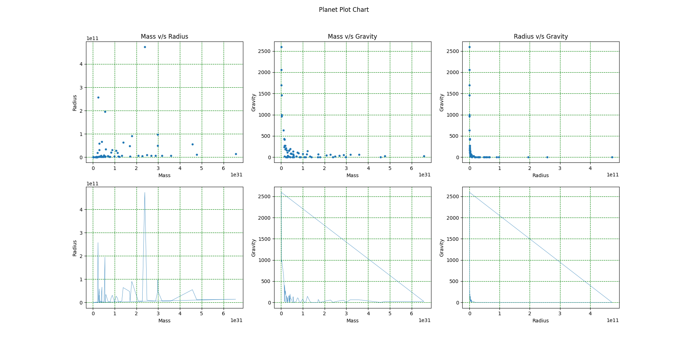

# Similar star finder 

> pro132 - graphing

this is a continuation of projects from `pro127` till `pro131`

### Features
- Used `matplotlib` to plot scatter and line charts of mass, radius and gravity

### Output

